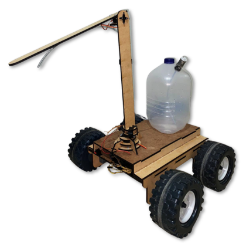
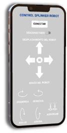

<!DOCTYPE html>
<h1>Splinker Robot</h1>

Splinker Robot is a mobile robot with a two-degree-of-freedom robotic arm designed for spraying fungicide on passion fruit crops. Implemented in ROS2 with URDF, Nodes and other files to simulate it in Gazebo and visualize it in RViz. Additionally, was prototiped with Arduino, MDF and respective actuators.

With respect to part mobile of robot, it is a differential robot with two motorized rear wheels and two front wheels without traction

<h1>Implementation</h1>

For the implementation was used an Arduino Mega 2560 as microcontroller, MDF(Medium Density Fibreboard) for the chassis and robotic arm, two gearmotors for the wheels, two servomotor for the robotic arm and a system of distribution of fungicide from the tank.

   
    
   
   
    
   

